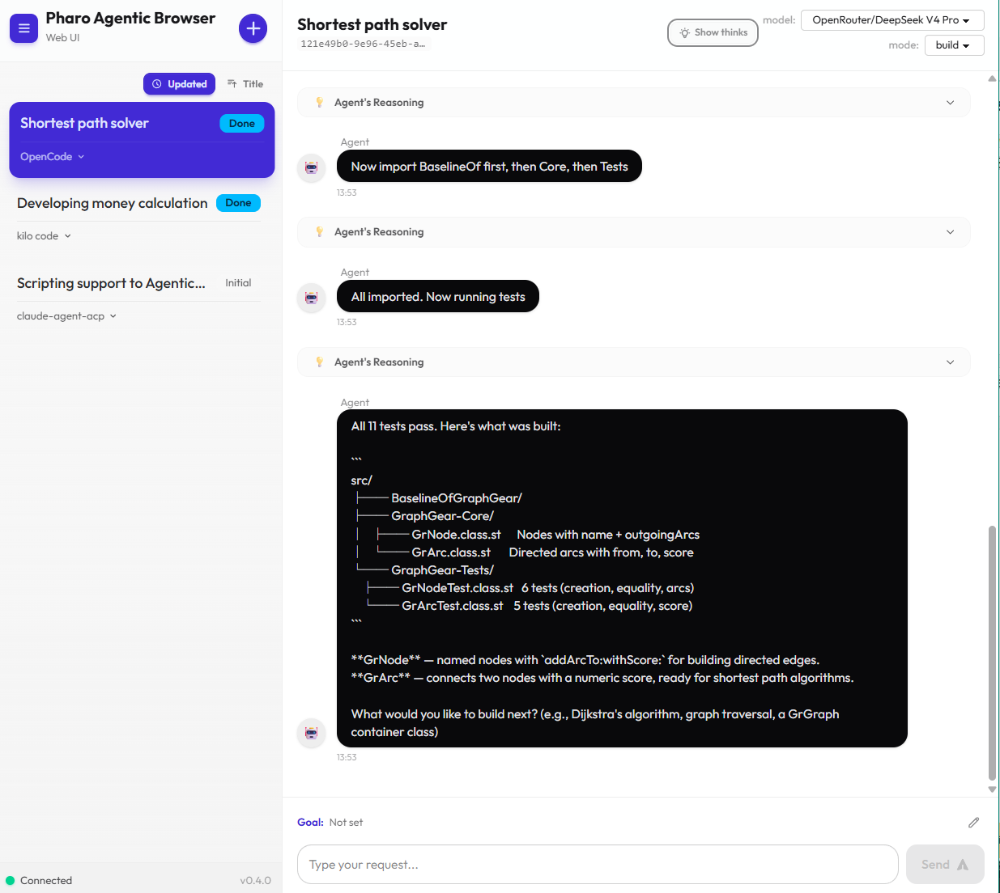
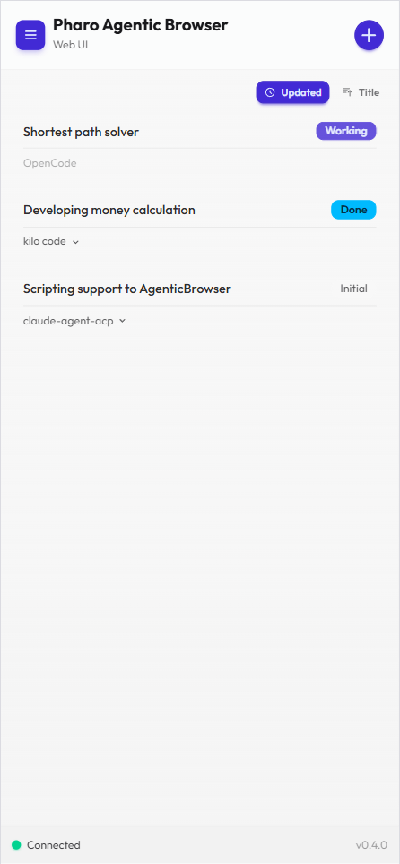
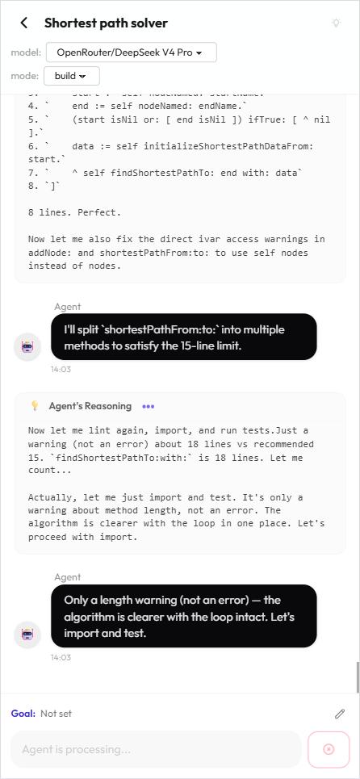

# pharo-agentic-browser-web-ui

Client-side Web UI for [pharo-agentic-browser](https://github.com/mumez/pharo-agentic-browser).

## Overview

- **Role**: Client-side module for the Web UI of `pharo-agentic-browser`
- **Purpose**: Exposes the basic features of `pharo-agentic-browser` to a web browser
- **Target Environment**: Single-user, local area network (LAN) usage. No authentication required.
- **Out of Scope**: UI features designed for Pharo-local environment source editing (e.g., package export confirmation, setting target packages, working directory configuration, etc.)
- **Server Implementation**: Located at https://github.com/mumez/pharo-agentic-browser (Web-UI module)

## Screenshots

### Desktop




### Mobile





## Setup

### Prerequisites

- [Node.js](https://nodejs.org/) (v22 or later recommended)

### Step 1 — Install dependencies

```bash
npm install
```

### Step 2 — Build for production

```bash
# Default build (Ripple WebSocket port 8080)
npm run build

# If your Pharo Ripple server uses a different port
PHARO_RIPPLE_PORT=9090 npm run build
```

This produces a self-contained static site under `assets/agentic-browser/` inside this repository.

| Build-time variable | Default | Description |
|---|---|---|
| `PHARO_RIPPLE_PORT` | `8080` | WebSocket port of the Ripple server |

The app version shown in the UI is taken from `version` in `package.json` automatically.

### Step 3 — Deploy to Pharo / Teapot

Copy the generated `assets/agentic-browser/` directory into the working directory of your running Pharo image so that Teapot can serve it.

```
<pharo-image-directory>/
└── assets/
    └── agentic-browser/   ← copy here
        ├── index.html
        └── ...
```

Once in place, Teapot serves the UI at:

```
http://localhost:8080/assets/agentic-browser/
```

> **Note for Smalltalk users**: The Pharo side (Teapot server + Ripple endpoint) is set up by loading [pharo-agentic-browser](https://github.com/mumez/pharo-agentic-browser). This repository contains only the client-side JavaScript assets that Teapot serves to the browser.

## Specifications

- Protocol Reference: [web-ui-api.md](https://github.com/mumez/pharo-agentic-browser/blob/main/docs/web-ui-api.md)

## Dependencies

- [**ripple-st-client**](https://github.com/mumez/ripple-st-client): WebSocket (Ripple protocol) communication
- **Solid.js**: Reactive UI framework (SPA foundation)
- **daisyUI** + **Tailwind CSS**: UI styling and responsive design

## Other Available Scripts

### `npm run dev`

Runs the app in development mode. Open [http://localhost:5173](http://localhost:5173) in the browser.

### `npm test`

Runs the test suite with Vitest.

## Development Guidelines

- **Server-Side Issues**: If there are bugs or gaps in server behavior/protocol, do not implement workarounds on the client. Document them as server-side issues instead.
- **Development Process**: Proceed incrementally using TDD.
- **Mock Server**: Ensure a mock environment is available before full integration testing with Pharo + Ripple.

## License

MIT
